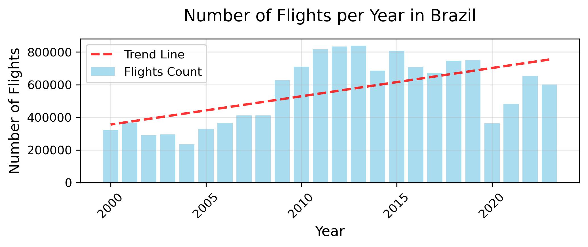

# 🛫 Brazilian Flights SQL Exploration (2000-2023)

**Technologies** │ DuckDB • SQL • Pandas • Matplotlib • EDA • Data analytics

---

## Project Summary

This repository contains the notebook, SQL queries, and requirements I used to analyse the **Integrated Brazilian Flight Dataset (BFD)**—14.7 million flight legs from 2000-2019, extended to 2023 with the latest ANAC on-time-performance releases.

  

---

## 1 · Why this project matters  

Commercial aviation is a cornerstone of Brazil’s transport network: the country moved **95.9 million passengers in 2014 and led Latin America in Revenue-Passenger-Kilometres** (Teixeira et al., 2021; ICAO, 2015).  
By interrogating the full BFD in pure SQL, this project demonstrates:

* **Analytical depth** – answering business-relevant questions on traffic growth, network structure, scheduling patterns, and operational reliability.  
* **Engineering pragmatism** – scanning a parquet file locally with DuckDB’s vectorised engine—no separate database server required.  
* **Communicative clarity** – converting result sets directly to Pandas for concise, publication-quality visualisations.

---

## 2 · Questions answered  

1. **Traffic growth** – How has air traffic evolved since 2000?  
2. **Network structure** – Which airports and city-pairs dominate the network?  
3. **Operational patterns** – What time-of-day and seasonal schedules do airlines follow?  
4. **Service quality** – Where do delays cluster, and which airlines perform best (and worst)?

---

## Data sources and Requirements

The original dataset is avaliable at:

Teixeira, C. et al. (2020). *Integrated Dataset of Brazilian Flights.* IEEE DataPort. DOI 10.21227/k10b-qn21. 

The requirements to reproduce the notebook are at **requirements.txt**.

